# ⚡ DLSS5 Universal Installer

### A portable, verification-first installer for community DLSS5 integrations on Windows games

Choose a game, inspect its real executable, select an integration method, download pinned upstream assets, verify SHA-256, install only declared files, and restore the selected installation when needed.

> This project is an installer and verification layer. It does not promise compatibility with every game, renderer, or DLSS5 component.

> **Experimental personal-use project.** This tool is provided as-is for experimentation and personal use. It may contain bugs, cause incompatibilities, or fail to install, run, or restore a game correctly. Review the planned changes and keep your own backups before using it. You accept responsibility for any results of running the installer; the authors provide no warranty or liability for data loss, game damage, performance issues, or other problems.

## 📖 Contents

- [🚀 Quick start](#-quick-start)
- [🎮 In-game verification](#-in-game-verification)
- [↩️ Restore](#️-restore)
- [✨ Features](#-features)
- [🎮 Installation methods](#-installation-methods)
- [📊 Compatibility](#-compatibility)
- [🧰 Custom packages and versions](#-custom-packages-and-versions)
- [🔬 How it works](#-how-it-works)
- [🛠️ Troubleshooting](#️-troubleshooting)
- [💻 Requirements](#-requirements)
- [📚 Documentation](#-documentation)
- [🔐 Safety and scope](#-safety-and-scope)
- [📁 Repository layout](#-repository-layout)
- [📄 License](#-license)

## 🚀 Quick start

1. Download or clone the repository.
2. Run `DLSS5-Universal.cmd`.
3. Select **Automatic installation**.
4. Enter the game path, or type `1` to open the Windows folder picker.
5. Review the executable candidates and choose the real game executable. Avoid launchers, editors, crash reporters, and dedicated servers.
6. Select Native/Bridge, OptiScaler, or ReShade + Feeder.
7. Review the conflict report and installation plan, then confirm.
8. Start the game and follow [In-game verification](#-in-game-verification).

The tracked defaults are English, Simple interface, locked automatic downloads enabled, elevation warnings enabled, and unknown-file deletion disabled. Personal changes are saved to ignored `config/settings.local.json`.

Enter `0` at any interactive prompt to cancel the current operation and return to the main menu. Use **Settings** to change language, interface mode, download policy, or elevation warnings.

## 🎮 In-game verification

After installation, compare the same save, scene, settings, and camera position:

1. Launch the game normally and load the test save.
2. Wait about 30 seconds, then check the same view with the camera still and moving.
3. Record native FPS, displayed FPS with frame generation, and whether you see ghosting, flicker, broken UI, or stutter.
4. Play briefly in a busy area. If the image or stability is worse, restore the installation.

`Home` is the usual ReShade overlay key. Other hotkeys are preset-dependent and are not guaranteed by this installer. Do not stack methods. See the [full verification checklist](docs/IN-GAME-VERIFICATION.md).

## ↩️ Restore

Choose **Restore a selected installation** to see recorded game paths, package versions, and installation manifests. Select the entry to revert. If a file changed after installation, the tool warns before overwriting it. Only files recorded by that installation are restored or removed; a full game copy is never created. An untracked cleanup snapshot can restore the manual components it saved, but cannot restore game DLL originals that were overwritten before the snapshot.

## ✨ Features

- One-click Bootstrap flow for pinned upstream releases;
- Native/Bridge, OptiScaler, and ReShade + Feeder methods;
- executable candidate scoring with Unreal/Unity technical-process filtering;
- Windows Explorer folder picker and manual path input;
- SHA-256 verification for downloads and staged files;
- conflict report and dry-run installation plan;
- point backups and manifest-based restore;
- Simple and Advanced inspection views;
- English and Russian interactive UI;
- `0` cancellation at every interactive prompt;
- custom local packages and alternate versions through manifests;
- no full game backups and no automatic deletion of unknown files.

## 🎮 Installation methods

| Method | Best fit | Trade-off |
|---|---|---|
| **Native/Bridge** | Games that already ship with native DLSS | Usually the lowest overhead; requires a compatible native path |
| **OptiScaler** | Games whose upscaler path can be redirected | Broad compatibility; proxy DLL conflicts are possible |
| **ReShade + Feeder** | Games without native DLSS when depth/motion data is available | Broadest route; usually costs more FPS and may need per-game tuning |

The installer treats these methods as alternatives. Restore the selected installation before switching methods.

## 📊 Compatibility

| Target | Native/Bridge | OptiScaler | ReShade + Feeder | Status |
|---|---:|---:|---:|---|
| DirectX 11 x64 | Candidate | Candidate | Candidate | Verify per game |
| DirectX 12 x64 | Candidate | Candidate | Candidate | Verify per game |
| DirectX 11/12 x86 | Not assumed | Not assumed | Host-dependent | Experimental |
| Vulkan / OpenGL | Not implemented | Not implemented | Not implemented | Out of scope |
| Online anti-cheat games | Not a target | Not a target | Not a target | Check game rules |

See the full [compatibility matrix](docs/COMPATIBILITY.md) for method guidance and detection limits.

## 🧰 Custom packages and versions

To install a different version or an unlisted package:

1. Place the archive in `packages/`.
2. Create a manifest with its exact source, archive SHA-256, and SHA-256 for every destination file.
3. Choose **Install a custom local package**, or run `-Action Install` with that manifest.

The tool does not download arbitrary URLs automatically and does not delete files absent from the manifest.

## 🔬 How it works

```mermaid
flowchart LR
    A[Select game folder] --> B[Inspect EXE candidates]
    B --> C[Choose the real game EXE]
    C --> D[Compare methods]
    D --> E[Download pinned sources]
    E --> F[Verify SHA-256]
    F --> G[Create point backup]
    G --> H[Install declared files]
    H --> I[Verify in game]
    I --> J[Restore selected install if needed]
```

Inspection is read-only. It reports executable architecture, API hints, native DLSS files, FSR/XeSS runtime hints, process state, and common proxy DLLs. A detected candidate is a hint, not proof that injection will work.

## 🛠️ Troubleshooting

- Wrong executable: run **Check**, then select the real game EXE during installation.
- Game fails to launch: use **Restore a selected installation** before trying another method.
- Image is unchanged: verify the selected method, ReShade add-on installation, and target executable.
- Download or install stops: run **Inventory packages and SHA-256** and compare against the lockfile and package manifest.
- Need more detail: switch to **Advanced** interface mode and keep the JSON inspection manifest with the installer log.

See the full [Troubleshooting guide](docs/TROUBLESHOOTING.md).

## 💻 Requirements

- Windows 10 or Windows 11 x64;
- PowerShell 5.1 or newer;
- DirectX 11 or DirectX 12 game target;
- writable game directory, or permission to approve elevation;
- internet access for locked automatic downloads;
- 64-bit games are the primary target; x86 support is method-dependent and not assumed.

## 📚 Documentation

| Document | Purpose |
|---|---|
| [Portable tool guide](docs/README.md) | Actions, profiles, settings, and operating flow |
| [In-game verification](docs/IN-GAME-VERIFICATION.md) | Repeatable visual, FPS, stability, and rollback checks |
| [Components and sources](docs/COMPONENTS.md) | Pinned versions, official upstream links, and file groups |
| [Compatibility matrix](docs/COMPATIBILITY.md) | Supported APIs, methods, and current boundaries |
| [Troubleshooting](docs/TROUBLESHOOTING.md) | Recovery steps and diagnostic collection |
| [Package manifest](docs/PACKAGE-MANIFEST.md) | Format for custom packages and alternate versions |
| [Safety](docs/SAFETY.md) | Download, backup, elevation, and anti-cheat boundaries |
| [Testing](docs/TESTING.md) | Generic validation procedure; personal tests stay local |
| [Implementation plan](docs/PLAN.md) | Current project scope and completed work |
| [Project TODO](docs/TODO.md) | Global backlog, compatibility work, and release tasks |

## 🔐 Safety and scope

- Sources must use HTTPS and a pinned SHA-256;
- point backups are created before replacing existing files;
- unknown existing DLLs are not removed automatically;
- administrator elevation shows a warning first;
- ReShade is the only third-party installer launched automatically, and only from the pinned Bootstrap source;
- online games with anti-cheat are outside the intended scope;
- a matching hash confirms file identity, not software safety.

The project does not commit downloaded binaries or proprietary NVIDIA files. Review upstream licenses and release notes before use.

## 📁 Repository layout

- `src/` — PowerShell implementation;
- `DLSS5-Universal.cmd` — Windows launcher;
- `config/` — tracked defaults and source policy;
- `config/settings.local.json` — ignored personal overrides;
- `packages/` — package archives and manifests;
- `downloads/` — downloaded source assets, ignored by Git;
- `staging/` — temporary extraction area, ignored by Git;
- `backups/` — point backups, ignored by Git;
- `manifests/` — generated inspection and installation records, ignored by Git;
- `local-tests/` — personal game test plans and results, ignored by Git;
- `docs/` — public operating and safety documentation.

## 🤝 Contributing

Use a feature branch and pull request. Keep personal settings, downloaded binaries, game paths, test results, and generated manifests out of commits. See [CONTRIBUTING.md](CONTRIBUTING.md) and [SECURITY.md](SECURITY.md).

## 📄 License

This project is licensed under the MIT License. See [LICENSE](LICENSE).
